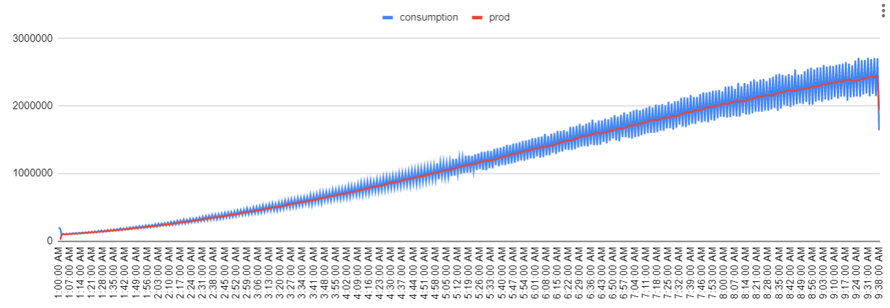

# Simulator

## Description

To have a better visualization of our system's regulation,
we developed a simulator that generate a `.csv` file by taking
the following parameters:

- `nbCommunity`: Number of communities.
- `nbHouseByCommunity`: Number of customers by community.
- `averageDayConsumptionByCommunity`: Average consumption (in Wh) per community during the day.
- `averageNightConsumptionByCommunity`: Average consumption (in Wh) per community during the night.
- `startingProd`: Initial production.
- `startingHour`: Hour when simulation starts.
- `endingHour`: Hour when simulation ends.

## Run

- Run the simulator:

```bash
./run-simulator.sh
```

## Example



## Authors

- [João Brilhante](https://github.com/JoaoBrlt)
- [Enzo Briziarelli](https://github.com/enbriziare)
- [Charly Ducrocq](https://github.com/CharlyDucrocq)
- [Quentin Larose](https://github.com/QuentinLarose)
- [Ludovic Marti](https://github.com/LudovicMarti)
